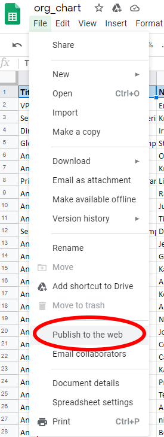
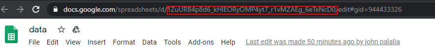
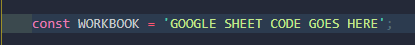

# Company-Chart

## This app has 2 parts:
* Part 1 - organize and prep data
* Part 2 - web application

## Part 1 - Data:
* Enter data into the excel sheet provided (Company_members.xlsm)
* This sheet has macros so make sure that you allow them to be enabled.
* DO NOT ALTER the first 3 columns.  These columns NEED to be in order for part 2 to work.
* All columns after column C can be altered
* DO NOT WORRY about the Id and Pid columns, the macro's will auto-create those columns
    * If you run into any problems with these 2 columns you can delete them
* Now that we have the rules for entering in the data lets talk about what happens next:
    * Hit the green button on the spreadsheet, this will sort the data based on who reports to who, it will assign id numbers and it will assign pid numbers.
    * If the green button is in the way of your columns you can right click it then drag it to where you would like it to sit on the spreadsheet.
    * After clicking the button the data is prepped and ready to be transferred to google sheets.
    * The google sheet that you will want to reference is [here](https://docs.google.com/spreadsheets/d/1YYrkklWddotgB6Ds-2KlbAJ_ZHX3Cot-BhKIBfKLIUY/edit#gid=1278237810).
    * For now you can just copy and paste from the excel file to the google sheet, hopefully we can automate this link up in the near future.
    * After the information is in the google sheet that's it!  The web page will automatically update to reflect those changes.

## Part 2 - Web App:
* The web app is for the most part complete but if you want to make future updates I want to point out the lines where you can make that happen.
* The first variable that might change is the reference to the google sheet.  If you want to switch to a new google sheet make sure you publish the sheet first.

    

* After publishing the sheet then grab the sheet code from the url.

    

* Now that we have the sheet reference find the variable WORKBOOK in the logic.js file and replace whats in the quotes.

    

